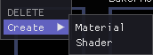
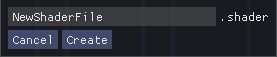
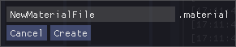

# Lightsteam Engine

This engine is being developed in C++ for the 3rd year class on *Engine development* at *UPC CITM* bachelor's degree in *Video game Design and development*.

Project's Github: https://github.com/MrIllas/Lightsteam-Engine

### Developed by

Robert Recordà i Illas [(MrIllas)](https://github.com/MrIllas)

## Features

Version 0.3 - CURRENT VERSION: 
 - New resource Material and Shader.
 - New "Component Material".
 - In-engine GLSL shader editor.
 - Combined Vertex and Fragment code in one code file compilation.
 - Inspector real-time uniform editing.
 - Use of shader binaries and library import.
 - Play/Pause/Tick functionality.
 - Open GL render updated to 401.
 - Tons of bug fix.
 - Performance and memory management improved.
	
Version 0.2:
 - Complete serialization.
 - Save/Load scenes.
 - Load images and meshes by dragging the file into the inspector.
 - Automatic generation of custom files from imported files.
 - Tons of bug fixing.
 - Frustum Culling for meshes.
 - Scene mouse picking.
 - Viewing of active resources from configuration segment.
 - Double camera.
 - Change active camera from configuration segment.
 - Move meshes with gizmo.

Version 0.1:
 - Load of FBX by drag & drop.
 - Load of image/textures by drag & drop.
 - Custom shader with simple light.
 - Translation, rotation and scaling of objects (without parent-to-child).
 - Scene free camera movement.
 - Transformation, Mesh Renderer and Texture components.
 - Enable/Disable of components

## Additional functionalities
 - Shader Program Binary
 - GLSL enhanced compilation. Vertex and fragment can be coded in the same file through the use of macros.
 - Multiple game cameras support(can be switched in configuration->Game).

## Special feature - Shader Pipeline

When importing a model to the library, the default shader will be automatically applied to its material(if there is one in the model's FBX).
Every ".shader" file created inside the editor starts with a basic template containing the most basic configuration. The template is the same default shader used by the engine every time a new FBX is imported to the library (in case it contains a material).

You can see the default shader inside the engine's GLSL editor [HERE](https://raw.githubusercontent.com/MrIllas/Lightsteam-Engine/main/docs/default_shader_editor.png)

### Shader file creation
 1. Right click inside the assets window.
 2. Create->Shader
 3. Type the desired name and click create.
 
 
 
 
 ### Shader editing
  1. Double-click a shader to open the GLSL editor.
  2. Edit the shader.
  3. Ctrl+S or File->Save to save and compile the shader.
   * Check the console in case of compilation error.
 
 
 
 
 ### Shader usage
  1. Select a Game Object.
    * Follow "Material file creation and usage" in case of not having a Material.
  2. Inside the "Material" component, unfold the combo and select the name of the desired shader.
  3. Edit the uniform values as desired.
    * For 'Sampler_2D', drag a texture from the assets window into the uniforms box.
    * For 'Vec3' and 'Vec4' colour, click the box to open a colour picker pop-up.
 
 ### Material file creation and usage
 1. Right click inside the assets window.
 2. Create->Material
 3. Type the desired name and click create.
 4. Select a scene Game Object.
   * Scroll down the inspector window and select Add Component->Material.
 5. Drag the created material into the 'EMPTY' box.
 6. In the combo menu select the desired Shader.
 7. Click 'SAVE' to save the configuration of that material.

### GLSL editor controls
 - Saving and compiling: File->Save or CTRL+S to save.
 - Themes:
 	- View->Dark palette.
	- View->Light palette.
	- View->Blue palette.
 - Undo: Edit->Undo or Ctrl+Z.
 - Redo: Edit->Redo or Ctrl+Y.
 - Copy: Edit->Copy or Ctrl+C.
 - Cut: Edit->Cut or Ctrl+X.
 - Delete: Edit->Delete or Del.
 - Paste: Edit->Paste or Ctrl+V.
 - Select all: Edit->Select all.

### Uniform list

GLSL(401) has a total of 105 different uniforms due to the current engine capabilities not all uniforms are currently supported, only the most essential ones can be used and updated from the inspector.
This is the list of supported uniforms:
 - bool
 - int/uint
 - float
 - float vec2 (vec2)
 - float vec3 (vec3)
 - float vec4 (vec4)
 - double
 - sampler2D
 - float mat4 (mat4)

### Special Uniforms
These are uniforms that are used natively by the engine and that every shader must have if certain functionalities need to be achieved.

**Projection**
```GLSL
uniform mat4 Projection;
```
Every shader must have it inside the Vertex macro. Allows the use of the projection matrix.

**Model**
uniform mat4 Model;
Every shader must have it inside the Vertex macro. Allows the use of the camera view matrix.

**View**
```GLSL
uniform mat4 View;
```
Every shader must have it inside the Vertex macro. Allows the use of the model matrix.

**Time**
```GLSL
uniform float LssTime;
```
Every shader must have it inside the Vertex macro. Allows the use of the engine internal time. Necessary for shader that update over time like a water wave.

**Colour special Keyword**
```GLSL
uniform vec3 thisIsAColor;
uniform vec4 thisIsAcolour;
```
When using a vec3/vec4 for colour picking, the keywords (Color,Colour,color or colour) inside a name updates the inspector view of the uniform variable to be a colour picker instead of a simple vector input.

### Binaries

Every time a shader is saved in compiled, the compiled binary is saved directly into the library. Every time that an already compiled shader is loaded by the resource system, it checks if the current binary version is the last (if it is not, it recompiles) and loads the binary directly from the library.

### Macro

Encapsulate the vertex and fragment code inside the following macros to compile the shader with only one file.
NOTE: The shader template used every time a new shader is created inside the editor already uses these macros. Currently, there is no way to compile shaders with separated files for vertex and fragment without accessing the engine's code, but the functions and methods to do so exists.

```
#ifdef VERTEX_PROGRAM
#endif
#ifdef FRAGMENT_PROGRAM
#endif
```
## Other Controls and features

### Game

 - New -> Use the play button to start the game simulation, pause it or just tick the simulation for per frame debugging.
 - Visualize active camera component.

### Scene

 - Click FBX with the mouse on the scene viewport.

### Scene Camera Controls

The camera controls only work when the mouse is positioned inside the scene window.

 - F -> Only if a node from the hierarchy is selected, teleports the camera on front of the selected game object.

While having the 'Right click" button of the mouse pressed:
 - W -> Displaces the camera frontwards.
 - A -> Displaces the camera to the left.
 - S -> Displaces the camera backwards.
 - D -> Displaces the camera to the right.
 - Q -> Displaces the camera up.
 - E -> Displaces the camera down.
 
 - Holding shift key multiples by two the speed of the camera displacement.
 
 - Alt left/Right -> Only if a node from the hierarchy is selected, orbits the camera around the selected object.


### Hierarchy

 - Mouse Right click -> Opens a pop-up menu that allows to create new nodes (Empty, Spatial and primitives).
 - Left click + drag -> Any node of the hierarchy can be moved to another node.


### Console

 - Clear button -> Clear the list of logs.
 - Log types -> Opens a menu that allows to filter the different log types.
 - Options -> Opens a menu with extra options for the console.
	- Collapse: Collapses all the logs that are exactly the same, adding a count number next to the log.
	- Time: Shows the time when the log has been registered. When collapsed, it shows the time of the last log.
	
	
### Inspector

Shows all the components of the selected node (Game object).
All components and inspector have an 'Active' checkbox that turn off and on the component.

**Note:** The scene node doesn't have any node, not even the transform node, since it doesn't need to be moved.

- Transform: Shows the position, rotation and scale and scale. It can be modified by pressing a field and dragging the mouse to the left or to the right.

- Mesh Renderer: The checkbox "Display normals" draws a line representing every vertex normal of the mesh. It also adds two new options to the component.
	- Checkbox "Face normals" draws the face normals instead of the vertex normals.
	- The Drag bar "Line Magnitude" modifies the length of the lines.
	- The mesh render component also shows the number of vertices, indices and face of the mesh.
	- FBX files can be dragged to the button in the inspector to switch the texture.

-  Textures:

    - The checkbox "Checkers textures" display a debug texture.
    - The texture component also displays the path from where the texture has been loaded, the size in pixels and the id of the texture.
	- Textures files can be dragged to the button image on the inspector to switch the texture.


### Drag and Drop functionality

 - When dragging an external file into the engine, the engine adds a copy of the file to the currently open content browser folder and performs a file check to import everything to the library.
 
 
### Content browser

 - The square with names are folder that can be opened with a left click.
 - The black square with no names insides are files. You can hold the file to read its complete name in case it's cut by the content browser columns.
 - FBX files can be clicked to open and see the meshes inside.
